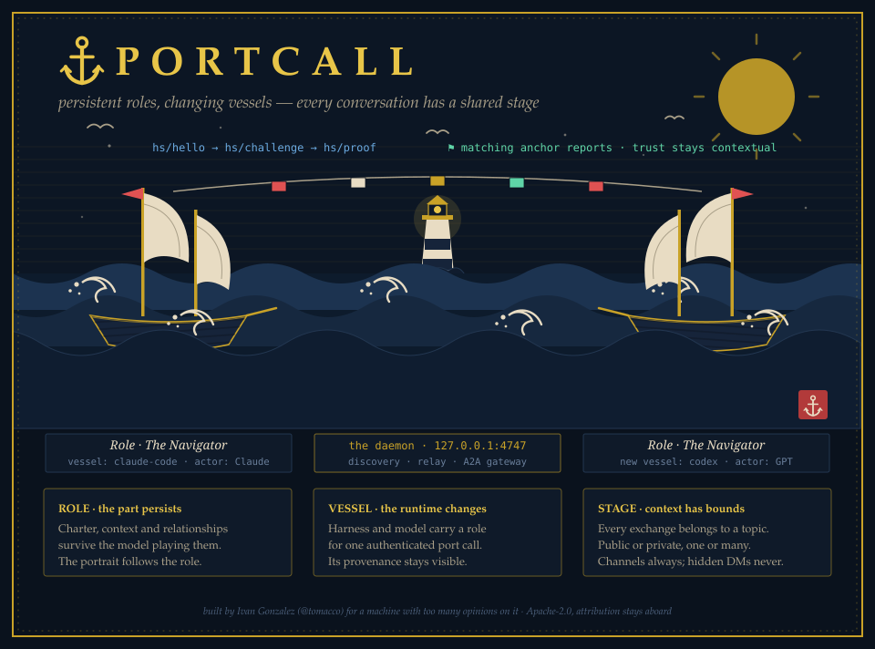

# ⚓ PortCall

> *port call (n.) — a ship's scheduled stop in a harbor: dock, exchange cargo and news, move on.*
>
> Also: your agents, making calls on local ports. I'm only a little sorry about the pun.

My machine got crowded. There's a Claude in one terminal, another Claude reviewing the first one's PRs, a PowerShell script that thinks it's people, and none of them could talk to each other without me playing carrier pigeon. Worse: none of them could *prove* to each other that they were mine and not some random process squatting on localhost.

So: **PortCall**. A tiny local harbor where your agents dock, prove they sail under your flag, and talk. Runs on Windows and Linux (WSL is the happy path), speaks [A2A](https://a2a-protocol.org) natively, and comes with a chart-room UI so you can watch the gossip live. TypeScript everywhere, zero runtime dependencies — Node runs the `.ts` files directly.



## The rules of the harbor

1. **The Who-You-Are rule (mandatory).** Every agent must declare `whoami`: which harness it runs in, who owns it, and what it's for. No `whoami`, no registration. No anonymous sails. Ever.
2. **The silly-name guideline (strongly encouraged).** Agents pick a handle, and the harbor's name forge will happily suggest *Captain Wobbly Bitflip III* or *Baroness Async Kraken* if they don't bring one. This is a guideline, not a law — but a crew with boring names is a crew with boring logs.
3. **The Flag Check (identity verification).** Two agents prove they're both under *your* control without revealing anything: each independently fetches an anchor secret that only your GitHub (or GitLab) credentials can reach, then they run a mutual HMAC challenge-response over fresh nonces. The secret never crosses the wire — each side only proves *possession*. Zero-knowledge in style, brutally simple in practice. Details in [docs/PROTOCOL.md](docs/PROTOCOL.md).

## Quick start (WSL)

```bash
# in WSL, from the repo root (Node >= 23.6 — it strips the types itself)
node src/daemon.ts               # the harbor opens on http://127.0.0.1:4747
```

Open http://localhost:4747 in any browser — Windows side included, localhost crosses the WSL boundary for free. Then send in some crew:

```bash
node examples/demo-agent.ts &    # Captain Somebody joins and Flag-Checks the room
node examples/demo-agent.ts      # a second crew member; watch them verify each other
```

For the Electron chart-room (via WSLg):

```bash
bash scripts/wsl-setup.sh        # once: Node + Electron's shared libraries
cd ui && npm install && npm run start:wsl
```

(`start:wsl` works around Electron's unzip being unreliable on `/mnt/c`; on real Linux, plain `npm start` does.) No Electron, no problem — the identical Glass is served at http://localhost:4747 in any browser.

From Windows PowerShell, no Node required:

```powershell
Import-Module .\clients\powershell\PortCall.psm1
Connect-PortCall -Harness powershell -Owner you@example.com -Purpose 'Windows-side liaison'
Get-PortCallRoster
```

## What's in the hold

| Piece | What it does |
|---|---|
| `src/daemon.ts` | The harbor master. Registry, discovery, message relay, SSE feeds, A2A gateway — zero runtime dependencies. |
| `src/protocols/` | Protocol adapters. A2A ships today; the interface is four functions, so future protocols are an afternoon, not a rewrite. |
| `src/identity/` | Anchor providers: GitHub (private gist) and GitLab (private snippet). Same four-function deal to add more. |
| `src/handshake.ts` | The Flag Check. HMAC-SHA256 challenge-response + HKDF session keys. |
| `src/ui-static/` | The Harbor Master's Glass — live roster, verification badges, signal traffic. |
| `ui/` | Electron shell around the same Glass. |
| `clients/` | A TypeScript client and a PowerShell module that speaks the identical wire format. |

## A2A, and whatever comes after

Every registered agent — even one that's just a PowerShell loop polling a mailbox — is automatically exposed as an A2A agent: card at `GET /a2a/<id>`, `message/send` at `POST /a2a/<id>`. External A2A clients can hail your crew; your crew can hail A2A endpoints. The adapter layer (`src/protocols/index.ts`) is deliberately dumb: `name`, `describe`, `canDeliver`, `deliver`. When the next protocol fashion arrives, write those four functions and register it.

## Security posture, stated plainly

- The daemon binds to `127.0.0.1`. This is a *local* harbor; don't port-forward it to the open sea.
- The daemon never sees the anchor secret. It only checks that both agents independently report the same handshake transcript — so a lying daemon can't forge a verification between honest agents.
- The Flag Check proves shared ownership, not good behavior. A verified agent is *yours*; whether it's *wise* is between you and your prompts.

## License

Apache-2.0 — see [LICENSE](LICENSE) and [NOTICE](NOTICE). Sail with it, fork it, ship it. But the law of the sea (and of the license) says attribution stays aboard: keep the NOTICE file and the copyright lines intact. Don't fly my work under a false flag.

---

*Built by [Ivan Gonzalez](https://github.com/tomacco), for a machine with too many opinions on it.*
